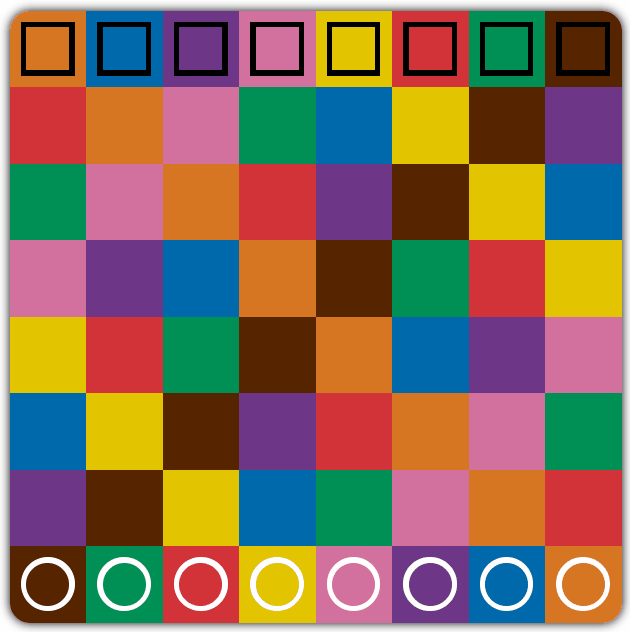

# Kamisado

[Kamisado](https://en.wikipedia.org/wiki/Kamisado) is an abstract strategy board game for two players that's played on an 8x8 multicoloured board. Each player controls a set of eight octagonal dragon tower pieces. Each player's set of dragon towers contains a tower to match each of the colours that appear on the squares of the board (i.e., a brown tower, a green tower, etc.). One player's towers have gold dragons mounted on the top, while the other player's towers are topped with black dragons.

## Rules

The player's towers start the game on the row nearest to them. The players take turns moving one tower any number of spaces in a straight line, either directly forwards or diagonally forwards, but not into or through a square already containing another dragon tower.

The first player may choose and move any tower. From this point onwards, each player **must** move the dragon tower that matches the colour of the square that the opponent's last move finished on.

The goal of the game is to reach your opponent's Home Row with one of your dragon towers. The first player to achieve this goal is the winner of the round. Additionally, if a player can't make a move, they lose.

## Technologies used

React, Redux, TypeScript, styled-components.

## Demo

